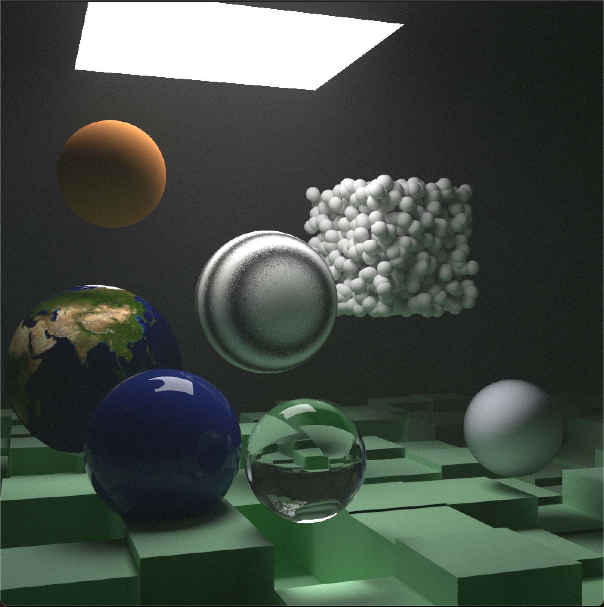
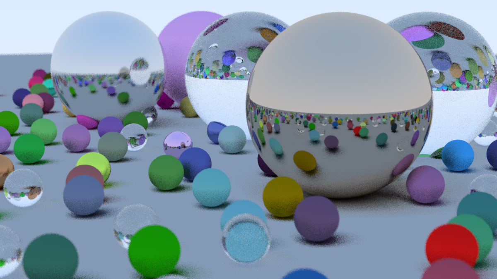
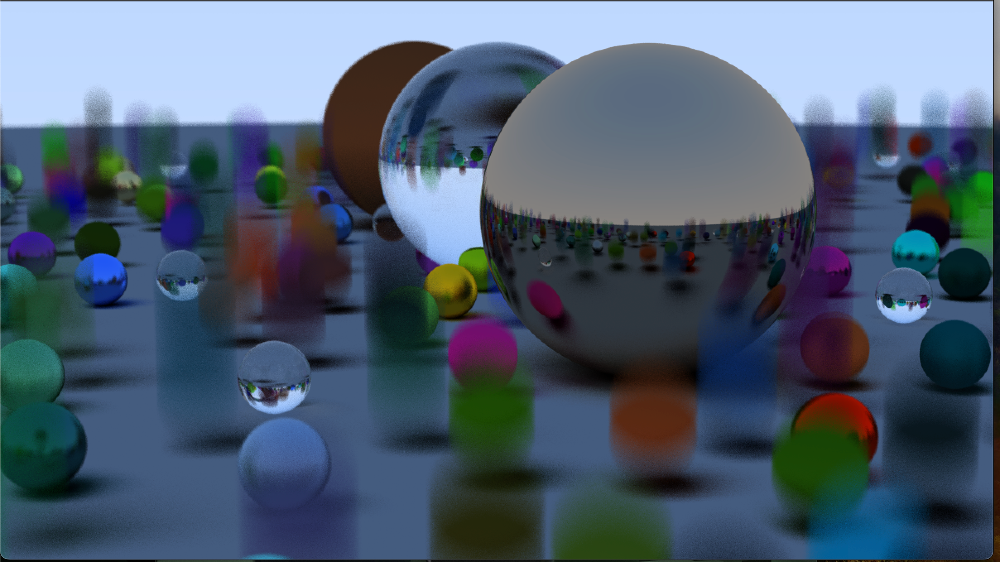
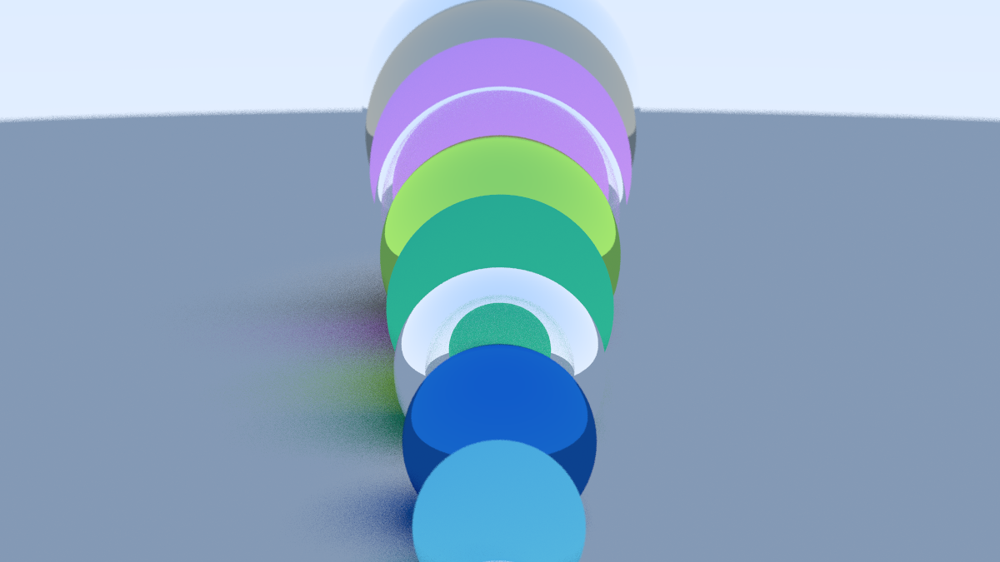
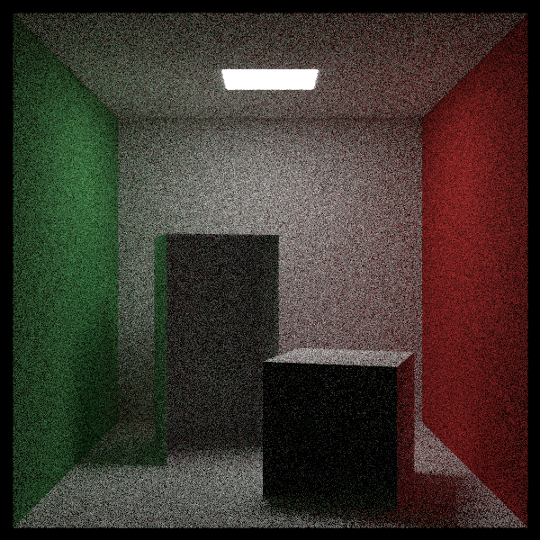

# Graphica

A multi-threaded ray tracer using BSThreadPool that can cut down on rendering speeds by 30% for smaller number of rays per pixel. For larger number of rays per pixel (e.g. 10000), the change is much more noticeable reaching almost 60% faster speeds. 

### How to run and build
```
cmake -B build/Release -DCMAKE_BUILD_TYPE=Release
cmake --build build/Release
build/Release/Graphica > image.ppm
```

Note: You can rename image.ppm to be whatever you want.

Sample images:











My rendered pyramids (Note: Have to fix some ray intersection math)

###### References:
- Threadpooling library: https://github.com/bshoshany/thread-pool
- Math for raytracing (Extended through multithreading and pyramid primitives): https://raytracing.github.io/